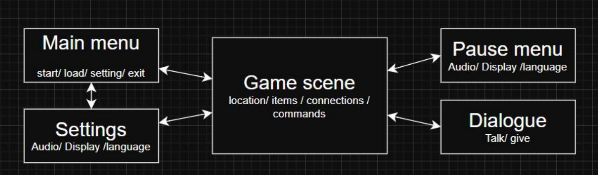
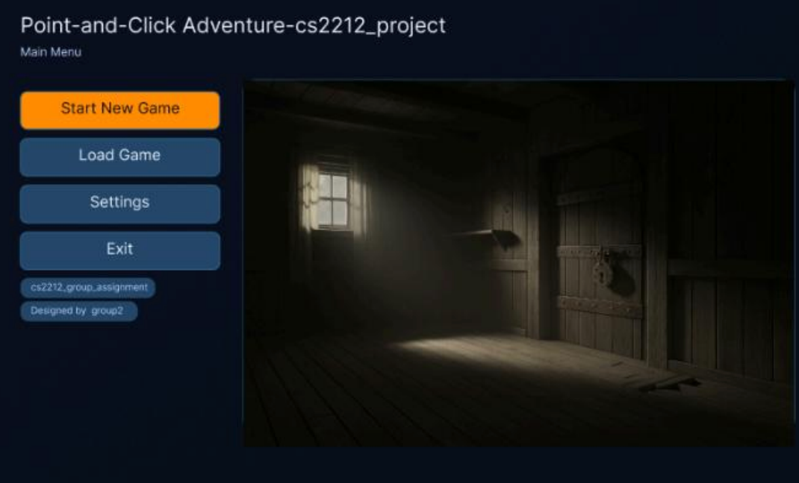
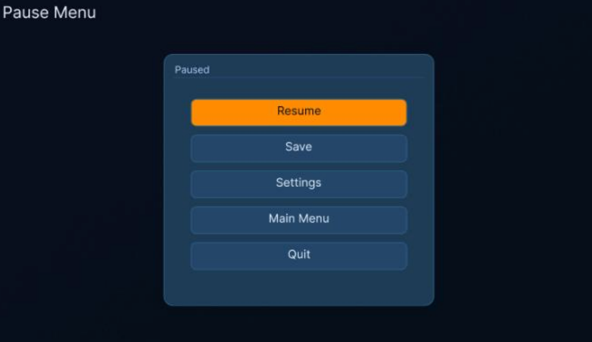
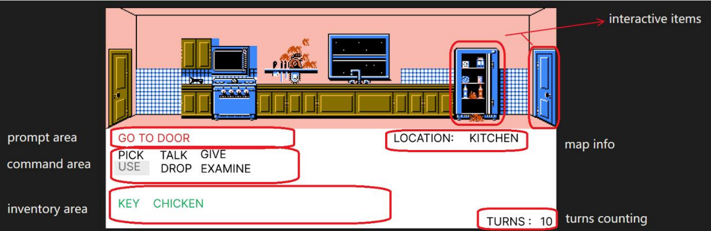
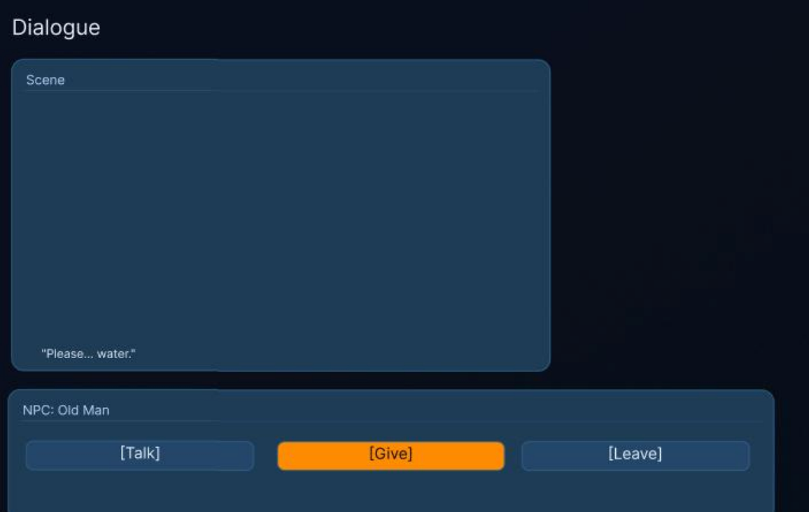
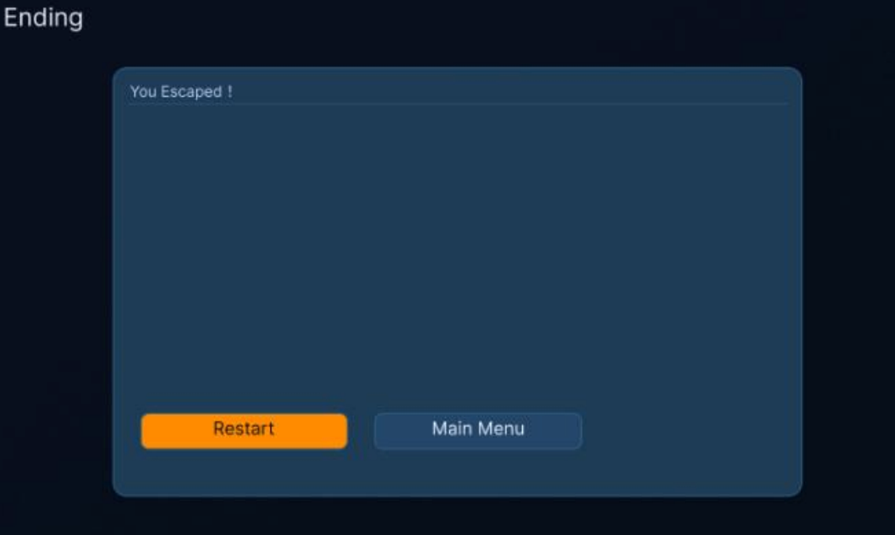

# CS2211 Group Project

# Design Documentation   

<table><tr><td>Version</td><td>Date</td><td>Author(s)</td><td>Summary of Changes</td></tr><tr><td>1.0</td><td>2025.10.22</td><td>Peiyong Wang, Zhixian Wang, Xinyan Cai, Junqi Zheng, Jialin Li</td><td>Create introduction, class diagram, user interface mockup, and summary sections.</td></tr><tr><td></td><td></td><td></td><td></td></tr></table>

<table><tr><td colspan="2">Table of Content</td></tr><tr><td>Section</td><td>Discription</td></tr><tr><td>1. Introduction</td><td>Overview of the problem being solved, the project&#x27;s objectives, and references to important documents.</td></tr><tr><td>2. Class Diagrams</td><td>UML class diagrams illustrating main classes, attributes, methods, associations, and design reasoning.</td></tr><tr><td>3. User Interface Mockup</td><td>Static images and written explanation of the interactive Figma mockup, covering UI layout and design choices.</td></tr><tr><td>4. Summary</td><td>Brief wrap-up of the documentation, including definitions for terms, notations, or abbreviations used</td></tr></table>

# 1 Introduction

# 1.1 Overview

This project delivers a data-driven Java engine for classic point-and-click adventure games. At runtime, the engine loads a JSON or XML data file that fully defines the world's locations (name, description, picture, connections, objects), objects (name, description, attributes, optional contained items), and characters (phrases, desired objects/attributes), along with rules that govern interactions (use, give). Gameplay advances in discrete turns with a visible counter and optional turn limit. A graphical UI presents the current location, pictures, description, objects, connections, the player's inventory, command buttons, command output/feedback, starting message, turn count, and an exit path. Because content and logic are externalized, the same engine can run multiple adventures by swapping the data file.

Functionally, the system must support core commands—Go, Pick Up, Drop, Inventory, Examine, Use, Talk, Give—and apply rules to create and transform game state in response to player actions. Non-functionally, it must be implemented in Java (desktop), use a GUI toolkit (Swing or JavaFX), parse JSON/XML, provide Javadoc comments, give clear error feedback, perform responsively, and follow consistent team coding conventions.

# 1.2 Objectives

The project aims to develop skills in the following areas:

1. Applying the principles of software engineering toward a real-world problem.   
2. Working with, interpreting, and following a detailed specification.   
3. Creating models of requirements and design from such a specification.   
4. Implementing the design in Java and dealing with decisions made earlier in the design process.   
5. Creating graphical, user-facing content and applications.   
6. Writing robust and efficient code.   
7. Writing good, clean, well-documented Java code that adheres to best practices.   
8. Reflecting on good and bad design decisions made over the course of the project.

# 1.3 References

1. CS2212A Group Project Specification - https://westernnu.brightspace.com/content/enforced/127086-UGRD_1259_3953/CS2212A%20Project%20Specification.html   
2. CS2211 Group Project Requirements Documentation (Group 2) -Gitlab, https://gitlab.sci.uwo.ca/courses/2025/09/COMPSCI2212/group02/-/wikis/Home/Requirements-Documentation   
3. Maniac Mansion - Wikipedia, https://en.wikipedia.org/wiki/Maniac_Mansion   
4. SCUMM - Wikipedia, https://en.wikipedia.org/wiki/SCUMM   
5. Class diagram - Wikipedia, https://en.wikipedia.org/wiki/Class_diagram

# 2 Class Diagrams

# Class Diagram Description

This UML class diagram depicts the core design of a point-and-click adventure game engine, emphasizing modularity and clear object-oriented layers. It cleanly separates game world data, player interaction, command processing, rule evaluation, and user interface into five main subsystems.

# System Architecture

1. Game Engine Layer Controls game flow by processing player commands, applying rules, and managing turn progression.   
2. Game Data Layer Defines the core data structures representing locations, inventory, entities and rules.   
3. Object and Rule Layer Represents interactive game objects and encapsulates game logic through rules.   
4. Command Layer Abstracts all player actions as commands, supporting validation and execution via the Command Pattern.   
5. User Interface Layer Manages all visual output and player feedback.

Each subsystem interacts via well-defined interfaces to ensure loose coupling and high cohesion.

# Key Classes and Responsibilities

- GameEngine: Central controller coordinating game data, UI, command execution, and turn updates.   
GameUI: Interface bridge that displays the current location, inventory, turn count, command bar and player messages.   
- ImageLoader and DataLoader: Utility classes for loading images and parsing external game data files.   
- GameData: Container for the entire game world, including locations, entities, rules and player inventory.   
- Location: Represents a game area containing objects, characters and connecting paths.   
- Connection: Directional link between locations; a specialized entity enabling player movement.   
- GameObject: All interactive items, supporting contained objects and attributes.   
- Entity(abstract): Connections, characters and gameobjects can be considered as a kind of entity in this game.   
- Rule (abstract) and subclasses UseRule and GiveRule: Implement game logic conditions and effects.   
Command (abstract): Defines player actions with subclasses like GoCommand, PickupCommand, UseCommand, each implementing validation execution.   
- Inventory: Manages the collection of objects held by the player, supporting add/remove operations essential for gameplay consistency.

# Relationships

- Composition:

GameData is composed of locations, rules, entities and inventory.   
Each Location contains collections of characters and connections.   
- Character and GiveRule are bundled.

- Aggregation:

- Location and Inventory aggregates GameObjectCollection.

Inheritance:

GameObject, Connection, and Character inherit from Entity.   
- UseRule and GiveRule extend abstract Rule.   
- All specific commands derive from Command.

- Dependency:

GameEngine interacts with GameData, Command and GameUI.   
- ImageLoader and DataLoader was called by GameData.

# Design Highlights

- Adoption of the Command Pattern enables extensible and testable player actions.   
- A Data-Driven Architecture separates configuration (loaded externally) from runtime logic.   
- Rule abstraction simplifies implementation of conditional game mechanics.   
- Encapsulation of game state within GameEngine improves maintainability and reduces side effects.   
- Modular subsystems facilitate independent testing and future expansions.

The image above provides a zoomed-out overview of the core class diagram.  
For a readable, zoomable version with all classes, attributes, and relationships, please use the interactive diagram below:

[View the full class diagram in draw.io / Google Drive](https://drive.google.com/file/d/16_b2MaaL0J-CO5Kfpis0DEJxO3AAQl12/view?usp=sharing)

# User Interface Design Documentation

# 1. Overview

This UI defines a visual, point-and-click layer over classic text-adventure mechanics. Players act through clear on-screen elements rather than typing, while puzzle depth is preserved. The interface favors clarity, immediate feedback, and consistent interactions. All actions should be discoverable, all results visible, and no operation should fail silently.

# 2. Navigation Flow

On launch, the application loads game data from JSON or XML and then shows the Main Menu. New Game leads to an initial starting message and then the Game Main Interface; Load Game (if present) resumes directly into the Game Main Interface; Settings returns to the menu after changes; Exit closes the application. During play, the user can open Settings or Pause if provided, then return to the Game Main Interface without losing context.

# 3. Main Menu

The application opens on the Main Menu, which sets the visual tone and provides primary navigation. It displays the title or logo and offers New Game, optional Load Game, Settings, and Exit. From here the user can start a new session, return to an existing one if implemented, adjust configuration, or quit.

# 4. Game Scene

Design Rationale   

<table><tr><td>Area</td><td>Function</td><td>Design Principle</td></tr><tr><td>Upper Game Scene</td><td>Displays the current room, characters, and objects.</td><td>Maintains player immersion by simulating a theatrical stage perspective. The scene provides strong spatial cues (doors, stairs, items, etc.).</td></tr><tr><td>Middle Command Verbs Area</td><td>Contains a set of clickable verb commands such as “Pick,” “Use,” “Talk to,” etc.</td><td>Replaces text-based command input with a graphical interface, making interactions more intuitive.</td></tr><tr><td>Lower Inventory Area</td><td>Displays the items currently held by the character.</td><td>Encourages players to think in terms of “item + action” combinations, forming a visual interactive language.</td></tr></table>

# 5. Dialogue Interface

When talking to a character, a semi-transparent overlay appears that preserves the sense of place. It shows the character name, an optional portrait, and the current line of dialogue. A Continue or Next control advances the sequence, while Close exits the conversation. When a character has no more to say, the interface explicitly indicates that the dialogue is exhausted.

# 6. End Screen

Reaching an ending location or hitting a turn limit transitions to an End Screen. It summarises the outcome with a victory or defeat message and shows the final turn count. From here the player may Play Again to restart, return to the Main Menu, or Exit the application.

# 4 Summary

This project delivers a data-driven, Java desktop point-and-click adventure engine whose UI replaces free-form text parsing with clear, consistent on-screen actions. At runtime the engine loads JSON or XML to define locations, objects, characters, connections, and interaction rules; content lives outside the codebase while the UI presents a three-area Game Main Interface (scene display, fixed command panel, feedback/status), alongside a Main Menu, Inventory panel, Dialogue overlay, Settings, and an End Screen. Core commands—Go, Pick Up, Drop, Examine, Use, Talk, Give, and optionally Inventory—follow a "command-first, then target" pattern, and multi-object actions use lightweight parameter dialogs. Feedback is immediate and visible: the log prints results, the scene and inventory update atomically, and a prominent turn counter advances with optional limits; navigation is straightforward from launch to New Game, with Load and Settings always accessible and a clean return path during play. Non-functional requirements emphasize Java (Swing/JavaFX), robust JSON/XML parsing, Javadoc documentation, responsive performance, and team coding standards to keep the codebase reliable and comprehensible.

The underlying architecture, as captured in the class diagrams, separates concerns into loosely coupled yet cohesive subsystems. GameEngine orchestrates flow, advances turns, and mediates between data, commands, and UI; GameData composes the world and relies on DataLoader and ImageLoader for external assets. The object and rule model centers on an Entity abstraction specialized by GameObject, Connection, and Character, while an abstract Rule is realized by UseRule and GiveRule to encapsulate conditions and effects. Player actions use the Command Pattern: an abstract Command defines validation and execution and is extended by concrete commands such as GoCommand, PickupCommand, DropCommand, ExamineCommand, UseCommand, TalkCommand, GiveCommand, and InventoryCommand. Key relationships include composition of world elements within GameData, aggregation of GameObjectCollection by Location and Inventory, inheritance from Entity for all interactive elements, and controlled dependencies from GameEngine to GameData, Command, and GameUI. Together, these choices preserve puzzle-solving depth while improving discoverability and usability, and they cleanly separate content from engine logic to enable extensibility, testability, and long-term maintainability.

