# CS2211 Group Project

# Requirements Documentation

<table><tr><td>Version</td><td>Date</td><td>Author(s)</td><td>Summary of Changes</td></tr><tr><td>1.0</td><td>2025/9/30</td><td>Jialin Li, Peiyong Wang, Xinyan Cai, Junqi Zheng, Zhixian Wang</td><td>Creating all sections</td></tr><tr><td></td><td></td><td></td><td></td></tr></table>

<table><tr><td colspan="2">Table of Content</td></tr><tr><td>Section</td><td>Description</td></tr><tr><td>1. Introduction</td><td>Overview of problem, objectives, and list of references.</td></tr><tr><td>1.1 Overview</td><td>Executive summary of the problem and system requirements.</td></tr><tr><td>1.2 Objectives</td><td>General objectives of the project.</td></tr><tr><td>1.3 References</td><td>Documents referenced throughout this requirements documentation.</td></tr><tr><td>2. Domain Analysis</td><td>Analysis of the project&#x27;s domain with key questions and discussion.</td></tr><tr><td>2.1 Domain Description</td><td>Description and definition of the project&#x27;s domain.</td></tr><tr><td>2.2 Domain Knowledge</td><td>Existing knowledge and insight about the domain.</td></tr><tr><td>2.3 Domain Issues</td><td>Common problems within the domain.</td></tr><tr><td>2.4 Domain Solutions</td><td>Typical solutions to domain problems.</td></tr><tr><td>2.5 Applying Domain Knowledge</td><td>How domain expertise informs and accelerates project development.</td></tr><tr><td>3. Functional Requirements</td><td>Specification of all functional requirements.</td></tr><tr><td>3.1 Functionality to be Delivered</td><td>Detailed description of what the software must do.</td></tr><tr><td>3.2 Scenario Model</td><td>Modeling of actors, use cases, and activity diagrams.</td></tr><tr><td>3.2.1 Actors</td><td>Table and descriptions of all system actors.</td></tr><tr><td>3.2.2 Use Cases</td><td>Table and detailed descriptions and visual diagrams of all use cases.</td></tr><tr><td>3.2.3 Activity Diagrams</td><td>Activity or swimlane diagrams per scenario.</td></tr><tr><td>4. Non-Functional Requirements</td><td>List and description of all non-functional requirements (usability, reliability, etc).</td></tr><tr><td>5. Summary</td><td>Final summary, glossary of terms, and reference tables if needed.</td></tr></table>

# 1 Introduction

# 1.1 Overview

This project implements a data-driven Java engine for classic point-and-click adventure games. The engine is designed to be a story and puzzle-centric system that loads all game logic from a separate data file.

At startup, the application loads a JSON or XML data file that declares the world, including locations, objects, characters, and rules that govern their interactions. Players progress via a compact command set to explore, solve puzzles, and reach one of the game's endings. The game advances in discrete turns with a visible counter and an optional turn limit for challenge/scoring.

A graphical UI presents the current location and image, available connections and items, the player's inventory, command feedback, the opening narrative, and a clear way to exit. Because all content and logic are externalized in the data file, the same engine can run multiple adventures by simply swapping files.

# 1.2 Objectives

The project aims to develop skills in the following areas:

1. Applying the principles of software engineering toward a real-world problem.   
2. Working with, interpreting, and following a detailed specification.   
3. Creating models of requirements and design from such a specification.   
4. Implementing the design in Java and dealing with decisions made earlier in the design process.   
5. Creating graphical, user-facing content and applications.   
6. Writing robust and efficient code.   
7. Writing good, clean, well-documented Java code that adheres to best practices.   
8. Reflecting on good and bad design decisions made over the course of the project.

# 1.3 References

1. Maniac Mansion - Wikipedia, https://en.wikipedia.org/wiki/Maniac_Mansion   
2. SCUMM - Wikipedia, https://en.wikipedia.org/wiki/SCUMM   
3. Domain analysis - Wikipedia, https://en.wikipedia.org/wiki/Domain_analysis   
4. CS2212: Domain Analysis, https://www.youtube.com/watch?v=agZ0IsT94U&list=PLHqF-GvlH0b2gxcEnjYjLwLQDbvOYDp&index=7

# 2 Domain Analysis

# 2.1 What is the domain for this project?

The software domain :

Classic Point-and-Click Graphic Adventure Games.

- The essence of the domain is a system designed to build point-and-click adventure games.   
Key examples of this domain include Lucasfilm Games' Maniac Mansion and The Secret of Monkey Island, which were highly popular.   
- The interaction model involves graphics, allowing players to simply "point and click" to issue commands.

# 2.2 What do we know about the domain?

- Technology Foundation:

game engines :SCUMM (Script Creation Utility for Maniac Mansion), which was created to ease development on Maniac Mansion. SCUMM functions as both a game engine and a programming language, allowing designers to define locations, items, and dialogue sequences without writing source code.

- Interaction Model:

The typical interaction features a verb-object design paradigm. The player uses a fixed, visible list of commands.

Data Structure:

application must load a file containing all the game's data, including rules, a list of all locations, and a list of all objects.

- Gameplay Mechanics: The games typically feature non-linear gameplay. For instance, Maniac Mansion requires the game to be completed in different ways based on the player's initial choice of characters, relying on each character's unique set of abilities.

# 2.3 What are the common issues encountered in this domain?

- Data Modeling Complexity: The system needs to manage objects that can be containers (containing other objects) and must track whether an object is hidden or only revealed after an action (like examining a loose floorboard).   
- Design Pitfalls : A significant challenge in adventure game design is avoiding sudden player death or enter a "no-win scenario" where the player can no longer proceed.

# 2.4 What are the common solutions to the above issues in this domain?

- Use object-oriented programming(oop) and polymorphism:

oop: create a generic Object base class and derive subclasses like PickableObject and Container. The Container class would have a List\<Object\> to manage its contents.   
- polymorphism: When program traverses the List in Location to render all the items, it doesn't need to determine whether each object is a "pickable" or a "container". It just calls the gameState.display() method, and the polymorphism mechanism automatically executes the display() method of the corresponding subclass to display each object correctly.

- Ensure multi-path solutions:

Try to provide multiple solutions to each puzzle, or allow the player to use different items with the same properties to solve the problem. For example, any item with the property "sharp" can be used to cut through vines, rather than being limited to a specific items.

# 2.5 How can we use this domain understanding to improve or accelerate development of this project?

- Referencing Best Practices: By adopting the SCUMM model, we can rely on established structures and reduce the time and effort.   
- Prioritize Data Focus: the application must load all game logic from an external data file (JSON or XML), we must prioritize the implementation and testing of the data structure design.   
- Highlight non-linear gameplay: incorporate non-linear gameplay, accommodate different puzzle resolutions based on the unique skills of the chosen playable characters.

# Comments

# 3 Functional Requirements

# 3.1 Functionality to be delivered

1. Game Initialization and Startup

- Load the specified game configuration file.   
- Display introductory narrative, including the title and background story.   
- Initialize player state (e.g., starting location, initial inventory, turn counter).

2. Location Navigation

- Allow the player to navigate between locations named connections (e.g., "north," "red door").   
- Upon entering a location, display: name, description, representative image, and available connections.

3. Location Contents

- List all visible objects and characters present in the current location.   
- Update the contents dynamically when objects are picked up, dropped, or revealed.

4. Object Interaction

- Enable pickup of designated objects and transfer them to the player's inventory.   
- Remove picked-up objects from the location.   
- Allow examination of objects to reveal detailed descriptions.   
- Support discovery of hidden objects through examinations.

5. Inventory Management

- Maintain and display the player's inventory at any time.   
- Support pickup/drop actions between inventory and locations.   
- Allow automatic assignment of initial items at game start.

6. Puzzle Mechanism

- Implement puzzles involving object usage, attributes, and substitution rules.   
- Solving puzzles may unlock new objects, locations, or narrative progress.

7. Character Interaction

- Enable predefined dialogue options with characters.   
- Characters should respond with narrative text or extended dialogue.   
- Support item exchange with characters, triggering responses, item rewards, or events.

8. Command Interface

- Provide a menu or command-based interface for all available actions.   
- Ensure each command generates immediate feedback (confirmation or error).   
- Reject invalid commands with clear error messages.

9. Turn Tracking and Scoring

- Deduct one turn for each player's action.   
- Maintain and display a turn counter.   
- Support scoring mechanisms based on actions, items, or puzzles solved.   
- End the game automatically when the turn limit is reached.

10. Game Endings and Replay

- Detect victory, defeat, or special-ending conditions.   
- Display ending narratives upon completion.   
- Provide summary results (e.g., turns used, score).   
- Allow the player to restart or exit the game.

11. Graphical User Interface (GUI)

Present a graphical interface showing:

i. Current location description and image

ii. Available commands

iii. Inventory contents

iv. Turn counter

v. Feedback area

- Dynamically update the GUI to reflect state changes.   
- Ensure the interface is responsive and user-friendly.

# 12. Game Configuration via Data Files

- Support defining multiple games through JSON or XML files.   
- Include configuration for locations, objects, characters, puzzles, and rules.   
- Load and execute any valid configuration file.

# 13. Error Handling and Stability

- Detect invalid actions (e.g., pick up fixed objects).   
- Provide clear feedback for invalid inputs or unavailable actions.   
- Ensure the game remains stable and does not crash on invalid input.

# 3.2 Scenario model

# 3.2.1 Actors

<table><tr><td>Name</td><td>Player</td></tr><tr><td>Description</td><td>The Player is the human user who interacts with the adventure game system via the user interface. The Player initiates actions such as launching the game, making gameplay decisions, triggering end or restart, and views system responses. Unlike the Data File, Player actively drives the system&#x27;s primary workflows as the main user actor.</td></tr><tr><td>Aliases</td><td>User, End User</td></tr><tr><td>Inherits</td><td>None</td></tr><tr><td>Actor Type</td><td>Person (human user actively using the system)</td></tr><tr><td>Relationships</td><td>None</td></tr></table>

<table><tr><td>Name</td><td>Data Files</td></tr><tr><td>Description</td><td>The data files are stored in JSON format, containing information about locations, objects, and characters, along with rules for object usage and character reactions.</td></tr><tr><td>Aliases</td><td>Database</td></tr><tr><td>Inherits</td><td>None</td></tr><tr><td>Actor Type</td><td>External system; passive.</td></tr><tr><td>Relationships</td><td>Data files provide data to the Game Engine. By swapping the data file, the application can support any number of different games.</td></tr></table>

# 3.2.2 Use case (definition and diagram)

#### Use Case: Start / Load Game

| Field            | Description                                                                                                                                                                                                                               |
| ---------------- | ----------------------------------------------------------------------------------------------------------------------------------------------------------------------------------------------------------------------------------------- |
| Name             | Start/Load Game                                                                                                                                                                                                                           |
| Primary actor    | Player                                                                                                                                                                                                                                    |
| Secondary actors | Data File                                                                                                                                                                                                                                 |
| Goal in context  | Player starts the game, system loads and validates the Data File to initialize the world and begin the session.                                                                                                                           |
| Preconditions    | Game installed, Data File accessible.                                                                                                                                                                                                     |
| Trigger          | Player launches the application and selects "Start."                                                                                                                                                                                      |
| Scenario         | Player opens application. Player selects start. System checks Data File validity. If Data File is OK: system loads and initializes world. Start scene message displayed. If Data File missing/corrupt: system shows error. |
| Alternatives     | None                                                                                                                                                                                                                                      |
| Exceptions       | Data File missing/corrupt—system shows error message.                                                                                                                                                                                     |
| Use case diagram | *(see diagram below)*                                                                                                                                                                                                                     |

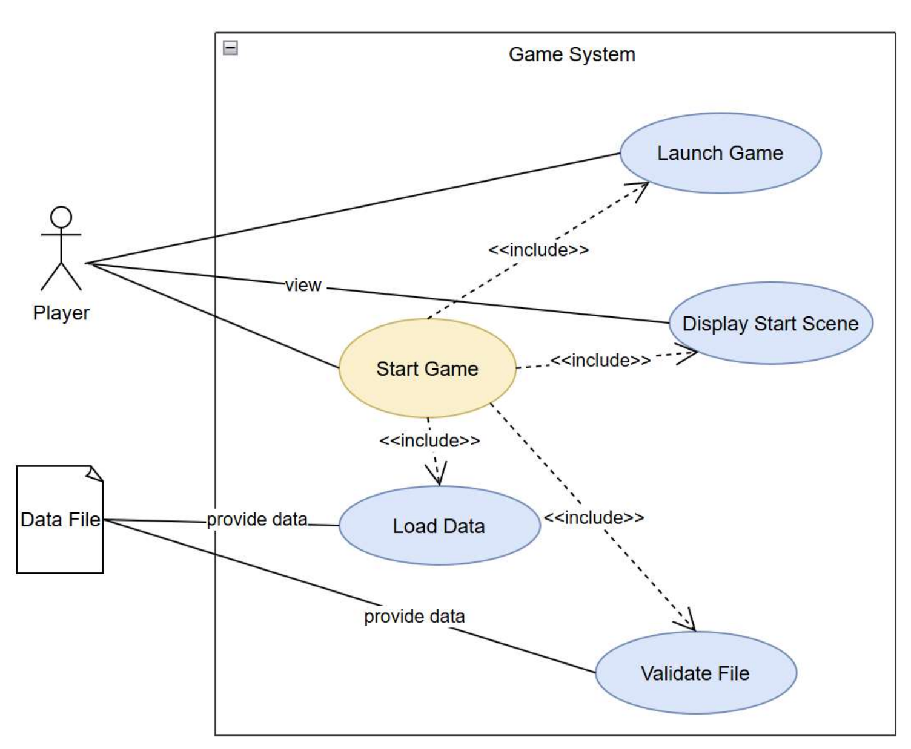

#### Use Case: Use items

| Field            | Description                                                                                                                                                                                                                                                                                                                                                                                                                                                                                                               |
| ---------------- | ------------------------------------------------------------------------------------------------------------------------------------------------------------------------------------------------------------------------------------------------------------------------------------------------------------------------------------------------------------------------------------------------------------------------------------------------------------------------------------------------------------------------- |
| Name             | Use items                                                                                                                                                                                                                                                                                                                                                                                                                                                                                                                 |
| Primary actor    | Player                                                                                                                                                                                                                                                                                                                                                                                                                                                                                                                    |
| Secondary actors | Data File                                                                                                                                                                                                                                                                                                                                                                                                                                                                                                                 |
| Goal in context  | Allows players to interact with themselves or other items using items in their inventory or current location to solve puzzles or advance the game.                                                                                                                                                                                                                                                                                                                                                                        |
| Preconditions    | 1/player is in a specific room for exploring. 2/player click the "use" command. 3.Object A is in the player's inventory or current location, Object B is in the player's inventory or current location.                                                                                                                                                                                                                                                                                                             |
| Trigger          | player click the "use" command on certain object.                                                                                                                                                                                                                                                                                                                                                                                                                                                                         |
| Scenario         | 1-player click the "use" command 2.system prompts player to choose the first object. 3/player has chosen one object, and then system prompts then player chooses 4.system checks the rules between object A and B, if match successfully, then present related results. 5.system updates inventory or map.                                                                                                                                                                                                    |
| Alternatives     | 1.only use object A(like food). 2.The system removes container objects (e.g. locked chests and keys) and adds the container's contents to the player's inventory/current location. 3.The system removes object A and object B and replaces them with a new object C (an open box), and then the system updates the list of objects at the current position. 4.Object A acts successfully on object B, the system triggers a change in the location connection in the game map or causes a new channel to appear. |
| Exceptions       | 1/object A and B don't match the rules: prompt something.                                                                                                                                                                                                                                                                                                                                                                                                                                                                 |
| Use case diagram | *(see diagram below)*                                                                                                                                                                                                                                                                                                                                                                                                                                                                                                     |

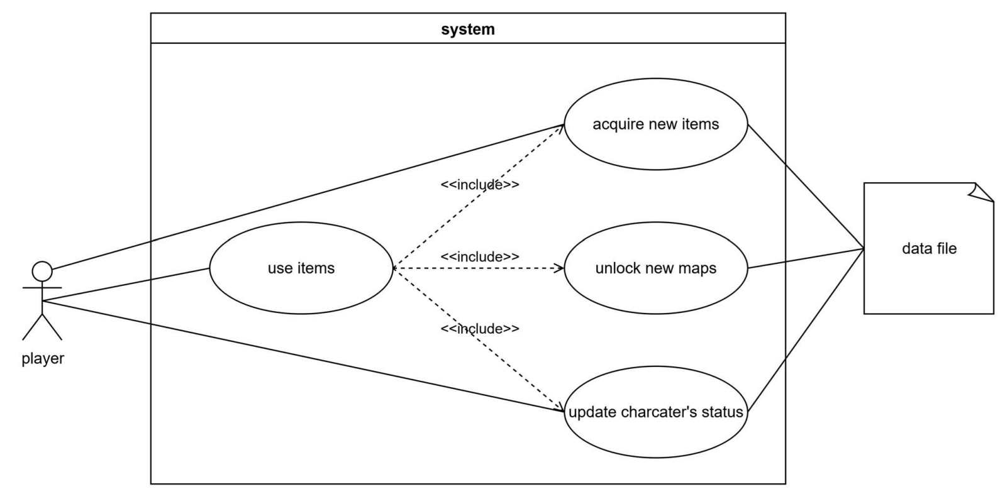

#### Use Case: Talk with NPC

| Field            | Description                                                                                                                                                              |
| ---------------- | ------------------------------------------------------------------------------------------------------------------------------------------------------------------------ |
| Name             | Talk with NPC                                                                                                                                                            |
| Primary actor    | Player                                                                                                                                                                   |
| Secondary actors | Data File                                                                                                                                                                |
| Goal in context  | Allows players to interact with game characters to gain information, receive/give items, and advance the game's narrative or puzzle solving.                             |
| Preconditions    | 1-player is in a specific room for exploring. 2-player click the "talk" command. 3.there are at least one person at the place.                                     |
| Trigger          | player click the "talk" command on around certain person.                                                                                                                |
| Scenario         | 1 player comes close to one NPC and then click the "talk" command 2 system prompts the texts from the NPC 3 player chooses one response 4 system prompts texts. |
| Alternatives     | 1 player receives the objects from the NPC. 2 NPC will response differently depending on the tasks completed or not by character.                                     |
| Exceptions       | 1.Inventory is full, preventing players from accepting items from NPCs.                                                                                                  |
| Use case diagram | *(see diagram below)*                                                                                                                                                    |

#### Use Case: Pick Up Item

| Field            | Description                                                                                                                                                                                                                                                                                                                                                                                                                                                                                                                                                                        |
| ---------------- | ---------------------------------------------------------------------------------------------------------------------------------------------------------------------------------------------------------------------------------------------------------------------------------------------------------------------------------------------------------------------------------------------------------------------------------------------------------------------------------------------------------------------------------------------------------------------------------- |
| Name             | Pick Up Item                                                                                                                                                                                                                                                                                                                                                                                                                                                                                                                                                                       |
| Primary actor    | Player                                                                                                                                                                                                                                                                                                                                                                                                                                                                                                                                                                             |
| Secondary actors | UI, Game State                                                                                                                                                                                                                                                                                                                                                                                                                                                                                                                                                                     |
| Goal in context  | Move a selectable object from the current location into the player's inventory.                                                                                                                                                                                                                                                                                                                                                                                                                                                                                                    |
| Preconditions    | 1. World data (JSON) successfully loaded 2. The object is visible in the                                                                                                                                                                                                                                                                                                                                                                                                                                                                                                        |
|                  |
| Trigger          | Player selects Pick Up and chooses a target object from the location list.                                                                                                                                                                                                                                                                                                                                                                                                                                                                                                         |
| Scenario         | UI asks the player to select an object currently in the location. System validates that the object exists in the current location and is selectable. System removes the object from the location and adds it to inventory. System increments the turn counter. UI refreshes the location list, inventory panel, message log, and turn display; shows success feedback.                                                                                                                                                                                                    |
| Alternatives     | A1: Object not selectable. UI shows "This item can't be picked up." No state change. A2: Object not present (already moved/hidden). UI shows "Item not available here." No state change. A3: Item requires discovery first. UI suggests Examine the container/room; after discovery, the object becomes selectable. A4: Inventory capacity rule (if designed). UI shows "Your inventory is full." No state change. A5: Duplicate prevention. If the same logical item is already in inventory due to prior actions, UI shows "You already have this." No state change. |
| Exceptions       | E1: Data integrity error (e.g., JSON references an object with missing ID/duplicate name). System aborts the action, logs ERROR with the offending JSON key/path; UI shows a professional error message. E2: Asset missing (image/path not found). System proceeds with a placeholder image; pick-up still succeeds; WARNING logged. E3: Concurrent state drift (rare, e.g., script removed the item between selection and confirmation). System revalidates just before mutation; if absent, UI shows "Item not available here." No state change.                           |
| Use case diagram | *(see diagram下面)*                                                                                                                                                                                                                                                                                                                                                                                                                                                                                                                                                                |

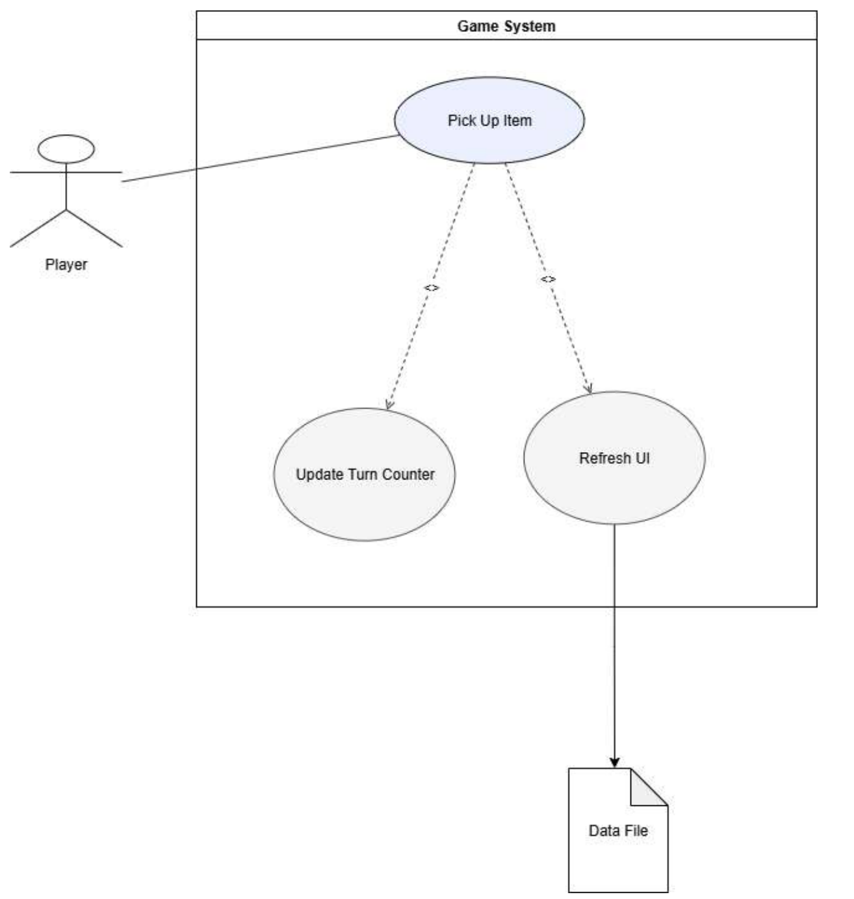

#### Use Case: Drop Item

| Field            | Description                                                                                                                                                                                                                                                                                                                                                                                                                                                                                                                                                                |
| ---------------- | -------------------------------------------------------------------------------------------------------------------------------------------------------------------------------------------------------------------------------------------------------------------------------------------------------------------------------------------------------------------------------------------------------------------------------------------------------------------------------------------------------------------------------------------------------------------------- |
| Name             | Drop Item                                                                                                                                                                                                                                                                                                                                                                                                                                                                                                                                                                  |
| Primary actor    | Player                                                                                                                                                                                                                                                                                                                                                                                                                                                                                                                                                                     |
| Secondary actors | UI, Game State                                                                                                                                                                                                                                                                                                                                                                                                                                                                                                                                                             |
| Goal in context  | Move an object from the player's inventory into the current location.                                                                                                                                                                                                                                                                                                                                                                                                                                                                                                      |
| Preconditions    | 1. World data loaded; current location available. 2. The item exists in the player's inventory.                                                                                                                                                                                                                                                                                                                                                                                                                                                                         |
| Trigger          | Player selects Drop and chooses an item from the inventory list.                                                                                                                                                                                                                                                                                                                                                                                                                                                                                                           |
| Scenario         | UI prompts the player to choose an item from inventory. System validates that the item is in inventory. System removes the item from inventory and adds it to the current location's object list. System increments the turn counter. UI refreshes the location list, inventory panel, message log, and turn display; shows success feedback.                                                                                                                                                                                                                  |
| Alternatives     | A1: Item not in inventory. UI shows “You don't have that item.” No state change. A2: Location forbids dropping (design rule, e.g., cutscene/locked scene). UI shows “You can't drop items here.” No state change. A3: Auto-merge/stacking (if designed; e.g., dropping coins stacks). System merges quantities; UI shows “Coins stacked.” Turn still increments. A4: Context transform (if designed; e.g., dropping a “seed” in “soil” spawns a “sprout”). System applies location rule, replaces item with produced object(s), logs action; UI reflects changes. |
| Exceptions       | E1: Data integrity error (dangling location reference or invalid object schema). System aborts, logs ERROR with JSON path; UI shows actionable error. E2: Placement collision (location object list constraints violated—name uniqueness enforced). System renames or rejects per rule; UI shows guidance (“Object already exists here.”). E3: Concurrent state drift (script removed the item from inventory just before drop). System revalidates; on failure shows “You don't have that item.” No state change.                                                   |
| Use case diagram | *(see diagram below)*                                                                                                                                                                                                                                                                                                                                                                                                                                                                                                                                                      |

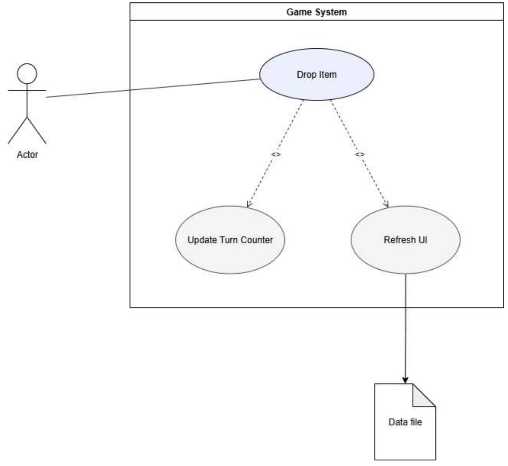

#### Use Case: Inventory

| Field            | Description                                                                                                                        |
| ---------------- | ---------------------------------------------------------------------------------------------------------------------------------- |
| Primary actor    | Player                                                                                                                             |
| Secondary actors | Data files                                                                                                                         |
| Goal in context  | Lists the objects that are currently in the player's inventory.                                                                    |
| Preconditions    | The player's inventory isn't on display on screen. It will be considered as a part of the game's interface. It will not disappear. |
| Trigger          | The player selects the "Inventory" and checks the inventory.                                                                       |
| Scenario         | 1. The player clicks "Inventory" 2. Items of the player are displayed on screen 3. The player can check what they own        |
| Alternatives     | None                                                                                                                               |
| Exceptions       | Game data loading error                                                                                                            |
| Use case diagram | *(see diagram below)*                                                                                                              |

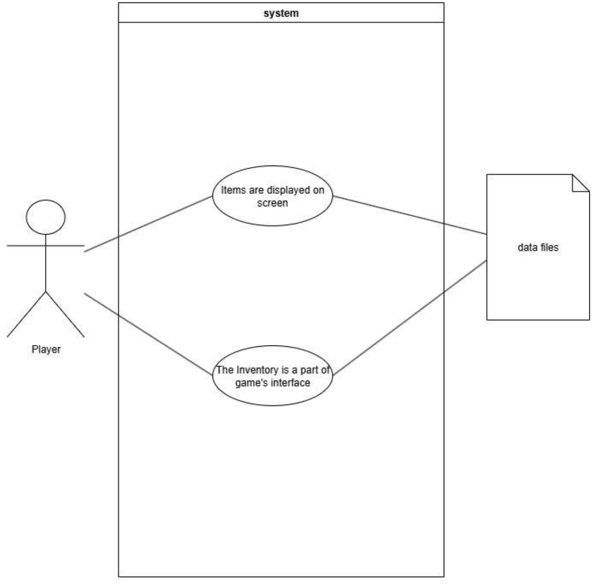

#### Use Case: Move to Location (Go)

| Field            | Description                                                                                                                                                                                                                                                                                                                                                                                                                                                                                                                                                                                                                                          |
| ---------------- | ---------------------------------------------------------------------------------------------------------------------------------------------------------------------------------------------------------------------------------------------------------------------------------------------------------------------------------------------------------------------------------------------------------------------------------------------------------------------------------------------------------------------------------------------------------------------------------------------------------------------------------------------------- |
| Name             | Move to Location (Go)                                                                                                                                                                                                                                                                                                                                                                                                                                                                                                                                                                                                                                |
| Primary actor    | Player                                                                                                                                                                                                                                                                                                                                                                                                                                                                                                                                                                                                                                               |
| Secondary actors | Data File                                                                                                                                                                                                                                                                                                                                                                                                                                                                                                                                                                                                                                            |
| Goal in context  | The player moves from the current location to a connected location by selecting a named connection and then sees the new location's details.                                                                                                                                                                                                                                                                                                                                                                                                                                                                                                         |
| Preconditions    | 1. Player is in a valid location. 2. The current location has at least one selectable connection. Only connections in the current location are offered (no undiscovered / other-location entities).                                                                                                                                                                                                                                                                                                                                                                                                                                               |
| Trigger          | The player selects the "Go" command.                                                                                                                                                                                                                                                                                                                                                                                                                                                                                                                                                                                                                 |
| Scenario         | 1. Player clicks "Go." 2. The system lists all available connections in the current location (e.g., "Door A," "Room B"). 3. The player selects one connection. 4. The system updates the player's current location. 5. The system displays the new location's name, description, a list of objects that the location currently contains (this list could be an empty list), characters, a list of named connections to specific other locations (this list could be an empty list, with a puzzle adding a connection to let the user out of the location), and pictures. 6. The turn counter is incremented, and the UI is refreshed. |
| Alternatives     | If the chosen location is an ending location, the system triggers the End use case.                                                                                                                                                                                                                                                                                                                                                                                                                                                                                                                                                                  |
| Exceptions       | 1. Player does not select a connection → System shows a message "No connection selected." → remain in current location. 2. The chosen connection does not exist or is corrupted in the data file → System shows an error → remain in current location.                                                                                                                                                                                                                                                                                                                                                                                            |
| Use case diagram | *(see diagram below)*                                                                                                                                                                                                                                                                                                                                                                                                                                                                                                                                                                                                                                |

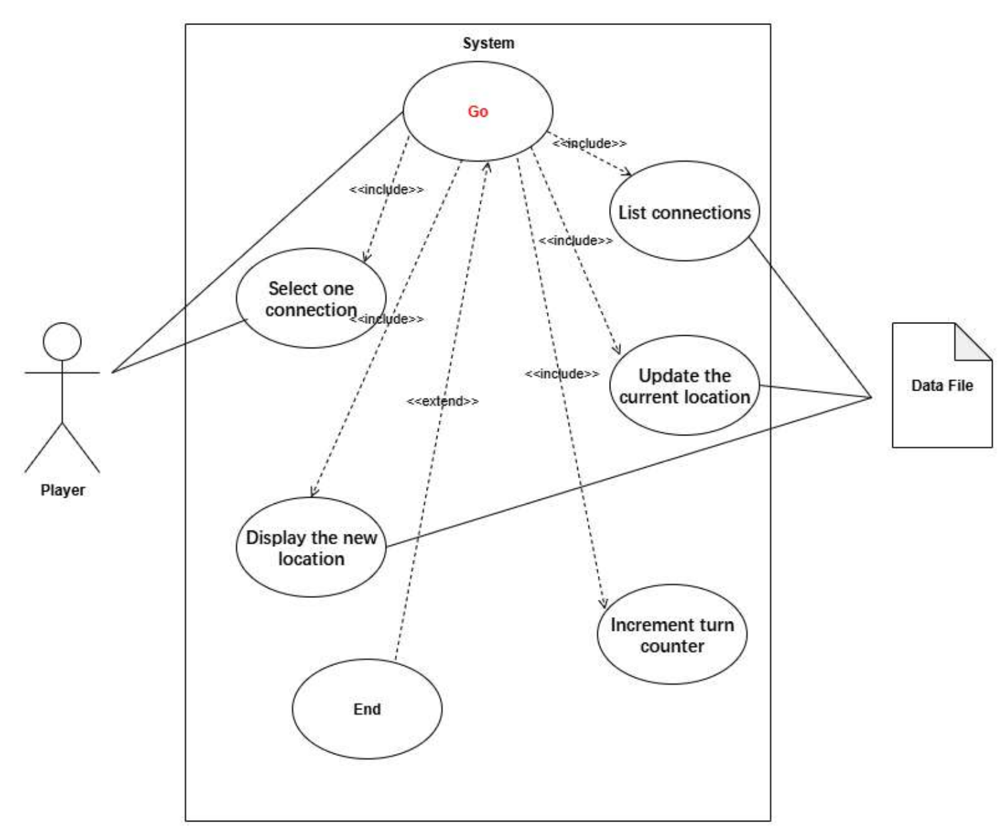

#### Use Case: Inspect Object/Character (Examine)

| Field            | Description                                                                                                                                                                                                                                                                                                                                                                                                                                                               |
| ---------------- | ------------------------------------------------------------------------------------------------------------------------------------------------------------------------------------------------------------------------------------------------------------------------------------------------------------------------------------------------------------------------------------------------------------------------------------------------------------------------- |
| Name             | Inspect Object/Character (Examine)                                                                                                                                                                                                                                                                                                                                                                                                                                        |
| Primary actor    | Player                                                                                                                                                                                                                                                                                                                                                                                                                                                                    |
| Secondary actors | Data File                                                                                                                                                                                                                                                                                                                                                                                                                                                                 |
| Goal in context  | The player inspects an object or character in order to see a detailed description and potentially discover hidden items.                                                                                                                                                                                                                                                                                                                                                  |
| Preconditions    | There exists at least one examable entity accessible to the player (in the current location or in the player's inventory).                                                                                                                                                                                                                                                                                                                                                |
| Trigger          | The player selects the "Examine" command and chooses an object or character.                                                                                                                                                                                                                                                                                                                                                                                              |
| Scenario         | 1. Player clicks "Examine." 2. The system displays a list of examable objects and characters in the current location and the player's inventory. 3. The player selects one target. 4. The system shows the description of the chosen object or character. 5. If the target is an object and contains other objects, the system adds those contained objects to the current location (object list). 6. System increments the turn counter and refreshes UI. |
| Alternatives     | Target is a character → show character description; do not add possessed objects to the location; those may only be obtained via Give interactions later.                                                                                                                                                                                                                                                                                                                 |
| Exceptions       | 1. Player does not select a connection → System shows a message "No target selected." 2. The selected target no longer exists (e.g., it was removed by prior action) → System shows an error message. The selected target has no description available → System shows "There is no further information."                                                                                                                                                            |
| Use case diagram | *(see diagram below)*                                                                                                                                                                                                                                                                                                                                                                                                                                                     |

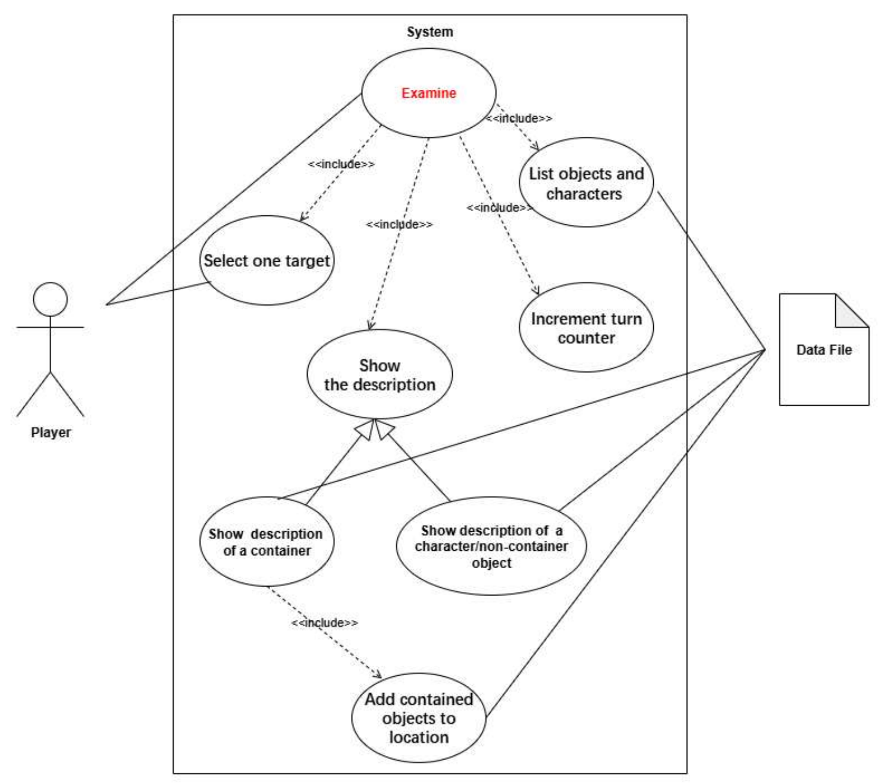

#### Use Case: Give Item

| Field            | Description                                                                                                                                                                                              |
| ---------------- | -------------------------------------------------------------------------------------------------------------------------------------------------------------------------------------------------------- |
| Primary actor    | Player                                                                                                                                                                                                   |
| Secondary actors | Data files                                                                                                                                                                                               |
| Goal in context  | Give an object from the player's inventory to a character.                                                                                                                                               |
| Preconditions    | The character does want the object.                                                                                                                                                                      |
| Trigger          | The player selects the "Give" and chooses an object.                                                                                                                                                     |
| Scenario         | 1. The player selects a character. 2. The player clicks "Give". 3. The player chooses an option in inventory for giving. The character rejects the item. The item will remain in the inventory. |
| Alternatives     | 1. The player checks to see if other items are needed by the character. 2. If the character accepts the item, the character may say something, give something, or end the game.                       |
| Exceptions       | The inventory is full. The player cannot accept the item from the character.                                                                                                                             |
| Use case diagram | *(see diagram below)*                                                                                                                                                                                    |

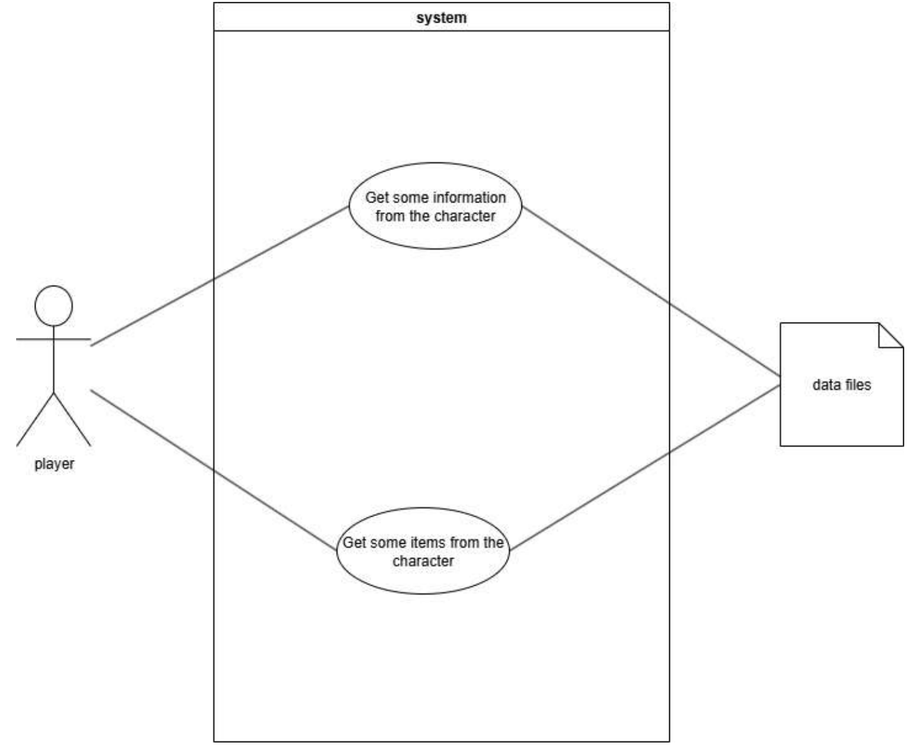

#### Use Case: End / Restart / Exit Game

| Field            | Description                                                                                                                                                                                                                                                                    |
| ---------------- | ------------------------------------------------------------------------------------------------------------------------------------------------------------------------------------------------------------------------------------------------------------------------------ |
| Name             | End/Restart/Exit Game                                                                                                                                                                                                                                                          |
| Primary actor    | Player                                                                                                                                                                                                                                                                         |
| Secondary actors | Data File                                                                                                                                                                                                                                                                      |
| Goal in context  | Player triggers end, restart, or exit; system may use Data File to reset for restart, or terminate application.                                                                                                                                                                |
| Preconditions    | Game is running or at an ending state.                                                                                                                                                                                                                                         |
| Trigger          | Player triggers end action or system end check.                                                                                                                                                                                                                                |
| Scenario         | 1. System checks if end condition is met. 2. If not met, the use case ends. 3. If end condition is met, system shows ending. 4. Player chooses restart or exit. 5. If restart: Data File is used to reset game data. 6. If exit: System terminates application. |
| Alternatives     | None                                                                                                                                                                                                                                                                           |
| Exceptions       | Error in restart/exit—system displays error message, then use case ends.                                                                                                                                                                                                       |
| Use case diagram | *(see diagram below)*                                                                                                                                                                                                                                                          |

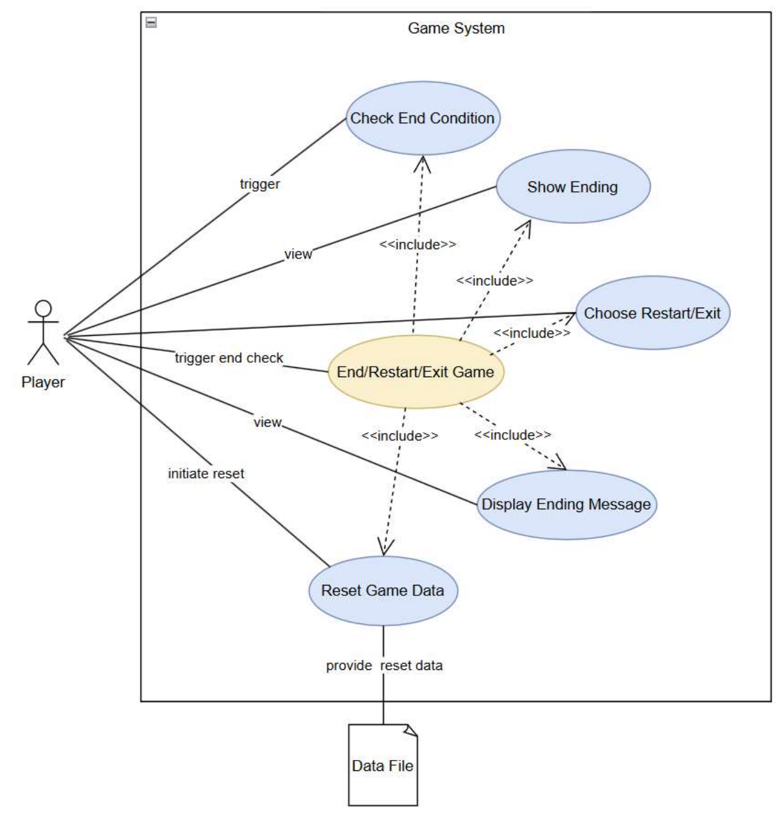

# 3.2.3 Activity diagrams

# 3.2.3.1 Start/Load Game

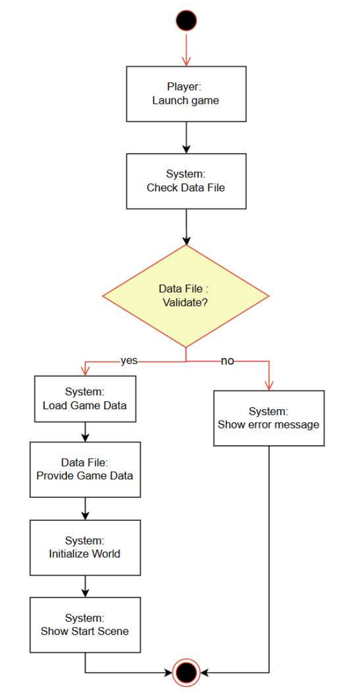

3.2.3.2 Use items

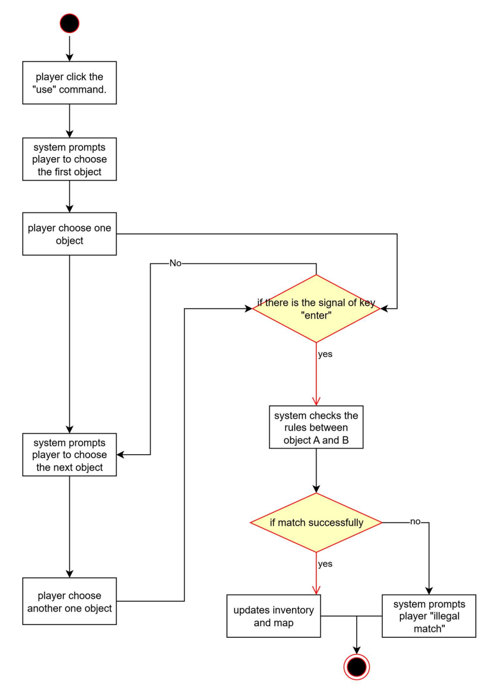
3.2.3.3 Talk with NPC

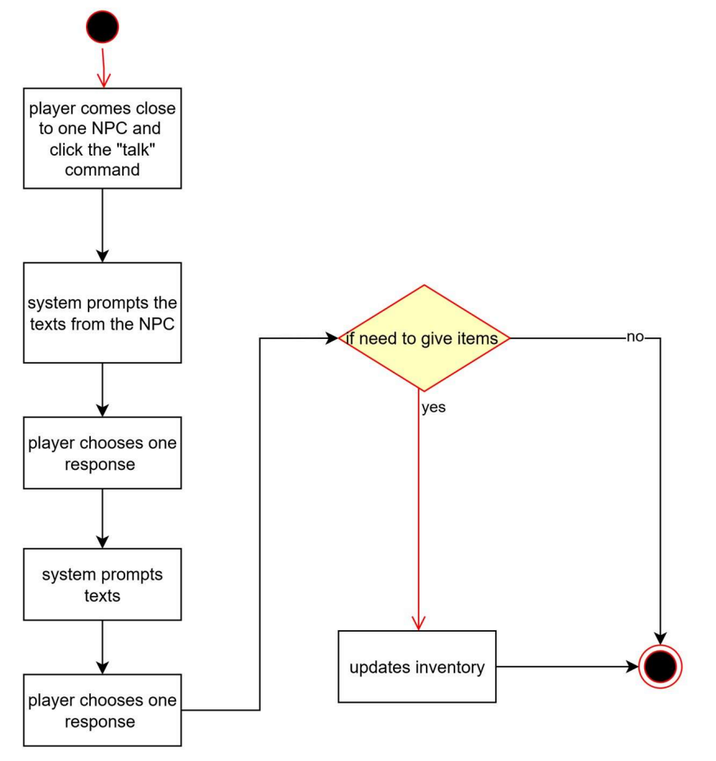
  
3.2.3.4 Pick Up Item   

3.2.3.5 Drop Item
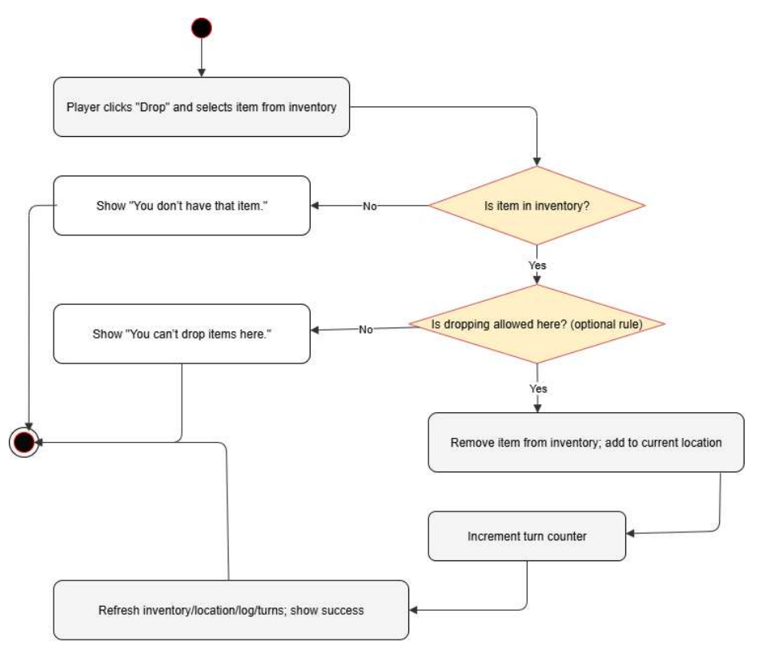

3.2.3.6 Check the Inventory

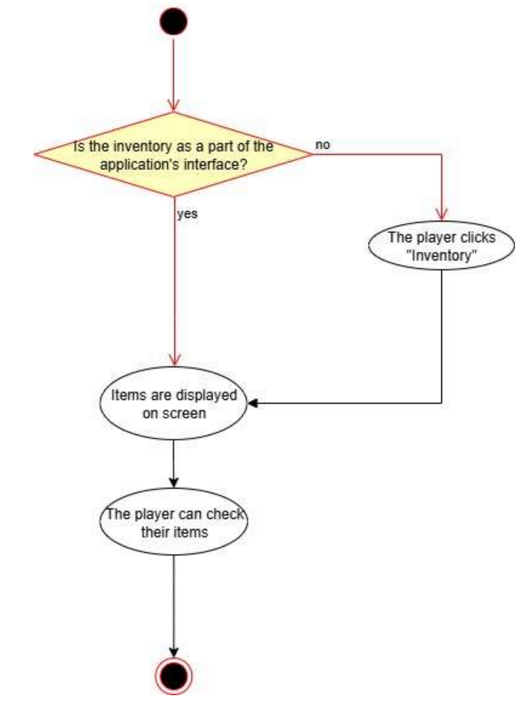  
3.2.3.7 Move to Location (Go)

 
3.2.3.8 Inspect Object/Character (Examine)

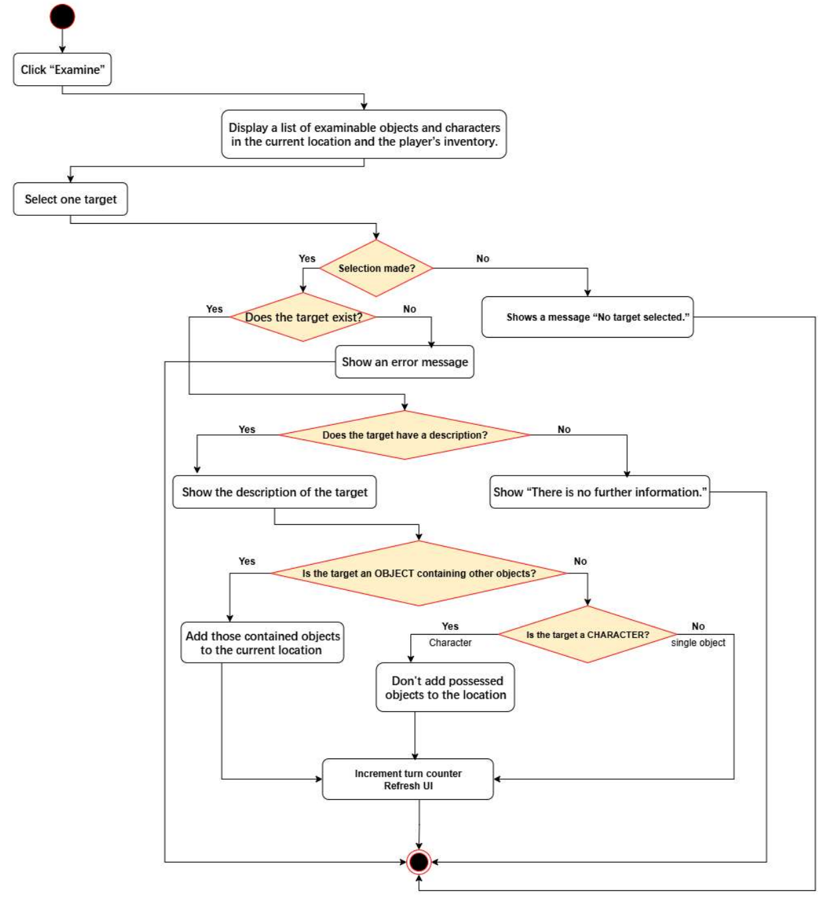

# 3.2.3.9 Give Items

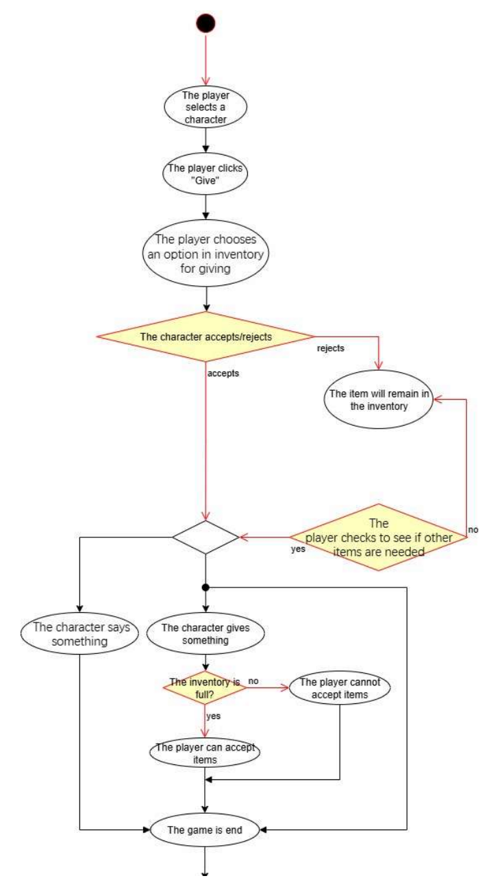

# 3.2.3.10 End/Restart/Exit Game
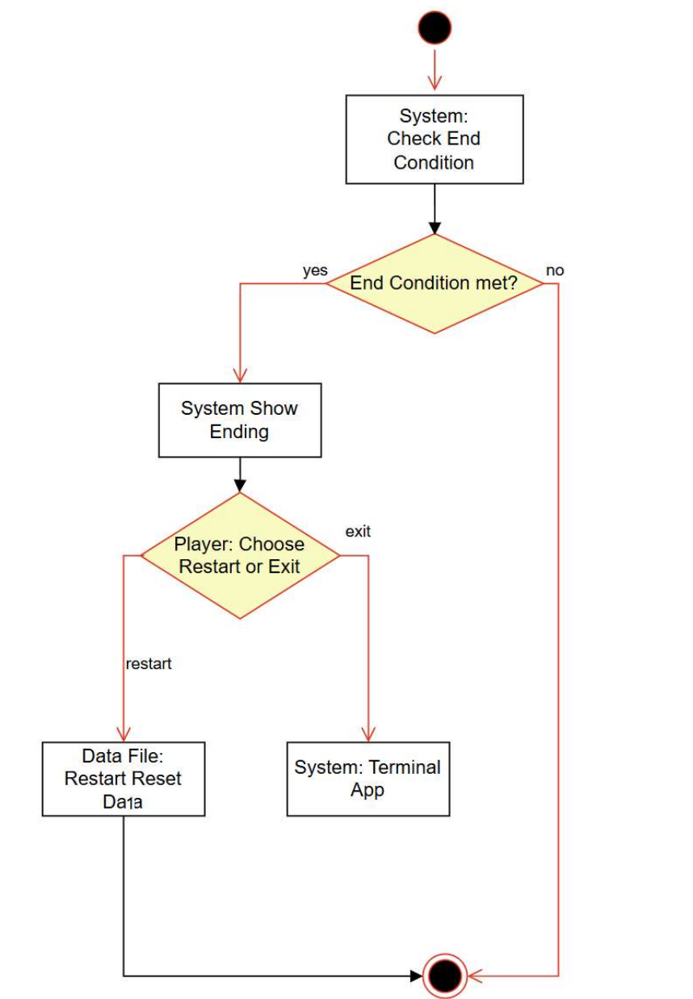

# 4 Non-Functional Requirements

# 4.1 Technology & Dependencies

Language / Platform — Java desktop, standalone (no server/runtime services). Acceptance: Builds and runs under a standard JRE on TA machines without IDE-specific features. Verification: Fresh JDK image $\rightarrow$ clean clone $\rightarrow$ build $\rightarrow$ run.   
- GUI Toolkit — Java Swing (team-wide single choice). Acceptance: Entire UI is implemented with Swing; no mixing with JavaFX or other GUI toolkits. Verification: Code inspection; dependency tree shows no UI frameworks besides Swing.   
- Data Format & Parser — JSON, parsed with Jackson (com.fasterxml.jackson). (XML support is out of scope for this submission.) Acceptance: Build file declares Jackson as the sole third-party dependency; Verification: Dependency audit via build logs/IDE; license and versions documented in README.

# 4.2 Performance & Responsiveness

- Startup Time — Load a course-scale game ( $\approx 10$ locations, $\geq 10$ objects, $\geq 3$ characters) within $\leq 1$ second (p95) on lab-spec hardware. Acceptance: Over 20 cold starts, p95 $\leq$ 1s. Verification: summary statistics committed with the build.   
Command Latency — Any command (render + rule execution) completes within $\leq 100$ ms (p95). Acceptance: Across command types (Go, Pick Up, Drop, Examine, Use, Talk, Give), p95 $\leq 100$ ms. Verification: Instrumentation at command handler boundaries; report exported as text/CSV.

# 4.3 Usability & UX

- Visibility of System Status — Every user action yields visible feedback (success, refusal, or error) in the output area. Acceptance: No user path results in a "silent" UI. Verification: Manual test matrix and exploratory testing notes.   
- Affordances & Error Prevention — UI presents only valid targets (e.g., non-pickable objects are not offered for Pick Up). Acceptance: Invalid targets cannot be selected in the Swing controls. Verification: Negative tests; heuristic UX review.   
- Learnability — A first-time user can complete the sample game without an external manual. Acceptance: Two novice users complete the sample within 25 minutes. Verification: Observational "hallway test" with a short task script.

# 4.4 Reliability & Data Integrity

- Deterministic Rule Matching — byName $\rightarrow$ byAttr (name matches take precedence over attribute matches). Acceptance: Same inputs yield identical outputs across runs. Verification: RuleEngine unit tests and replay tests with fixed random seeds (if any).   
- Load-time Validation — Fail fast on invalid data (non-unique names, dangling connections, missing images), with actionable messages. Acceptance: Application does not crash; error dialogs/logs identify the faulty JSON entry. Verification: A corrupted-data suite (broken IDs, missing assets) executed pre-submission.   
- Single Source of Truth — GameState is authoritative; Swing views never maintain divergent copies of state. Acceptance: After each action, views refresh from GameState. Verification: Code review; property-change tests validate UI refresh.

# 4.5 Portability & Environment

- Cross-Machine Reproducibility — Any teammate can clone, build, and run using the README steps. Acceptance: "Build & Run" works verbatim on two distinct machines (OS/Java versions documented). Verification: Fresh-environment rehearsals recorded in the repo.   
- File Boundaries — The app must not create/modify/delete files outside its installation directory and subdirectories (an optional, user-approved data directory is allowed). Acceptance: No out-of-bound writes during scenario tests. Verification: File-system monitors/sandbox runs with path whitelistging.

# 4.6 Security & Privacy (Right-Sized)

- Local-Only Operation — No network I/O; no telemetry or analytics.

Acceptance: No outbound connections during execution.

Verification: Packet capture; code inspection for networking APIs.

Resource Loading — Images and assets use project-relative paths with graceful fallback (placeholder) if missing.

Acceptance: No hard-coded absolute paths; missing assets do not crash the app.

Verification: Rename the asset folder; app shows placeholders and remains usable.

# 4.7 Maintainability & Code Quality

- Javadoc Coverage — All public classes and methods include Javadoc (purpose, parameters, returns, exceptions).

Acceptance: Javadoc generation completes without missing-doc warnings on public APIs.

Verification: mvn javadoc:javadoc or IDE inspections (report archived).

- Consistent Style — Team-wide style guide (naming, formatting, braces); enforced via IDE formatting and/or Checkstyle.

Acceptance: Style checks pass on all files; no mixed conventions.

Verification: Checkstyle/IDEformatter configured and run in CI or locally.

# 4.8 Accessibility & Internationalization (Recommended)

- Keyboard Access — All commands reachable via keyboard shortcuts; shortcut map visible in the UI and README.

Acceptance: Operable with mouse disabled.

Verification: Manual test run using only the keyboard.

- Scalable Text — Base font size adjustable (+/-) or follows OS scaling without layout breakage.

Acceptance: $\pm 1$ step retains readability and layout stability.

Verification: UI inspection under different DPI settings.

# 4.9 Logging & Error Handling

Structured Logging — INFO lifecycle events; WARN for recoverable issues; ERROR for failures with user-readable messages.

Acceptance: A single playthrough log is sufficient to reconstruct user actions.

Verification: Log review attached to the submission.

- Graceful Degradation — Missing assets/rules yield placeholders or guidance; no uncaught exceptions.

Acceptance: App does not crash under asset-rule faults.

Verification: Chaos tests (remove one image, corrupt one rule) with expected messages.

# 4.10 Build & Version Control

Single-Command Build - mvn package (or Gradle equivalent) produces a runnable artifact or documented run configuration.

Acceptance: Fresh clone $\rightarrow$ build $\rightarrow$ run in $\leq 3$ steps.

Verification: TA rehearsal script included in README.

- Commit Hygiene — Regular, meaningful commits; avoid dumping large binaries into source folders.

Acceptance: History shows steady progress rather than last-minute bulk drops.

Verification: Repository audit by date and diff size.

# 4.11 Content Attribution (Images & Third-Party Assets)

- Credits — Every location image and third-party asset is credited in the Wiki (References/Assets) and/or CREDITS.md (license noted where applicable).

Acceptance: The exported PDF/Wiki lists a source for each asset.

Verification: Documentation spot-checks against the asset folder.

# 4.12 Acceptance Summary (Checklist)

- Startup $\leq 1$ s (p95); command latency $\leq 100$ ms (p95)   
- Deterministic rules; JSON validated at load; actionable error messages   
Full Javadoc on public APIs; consistent style; modular packages   
- No out-of-bound file writes; no network I/O   
- Every action yields visible feedback; keyboard accessible   
- All third-party resources are properly credited

# Comments

# 5 Summary

This project delivers a data-driven, desktop Java engine for classic point-and-click adventure games. The engine loads a JSON data file at startup (locations, objects, characters, rules) and exposes a small command set—Go, Pick Up, Drop, Examine, Use, Talk, Give etc. to let the Player explore, solve puzzles, and reach one of several endings. The UI is implemented in Java Swing and presents the current location (name, description, picture, connections), items, inventory, command output, starting message, and a turn counter (with optional turn limit).

# Comments
